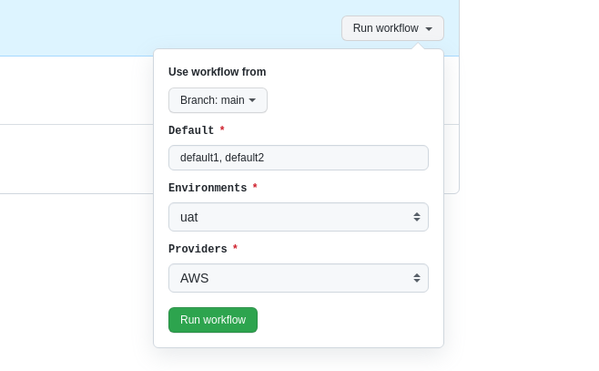
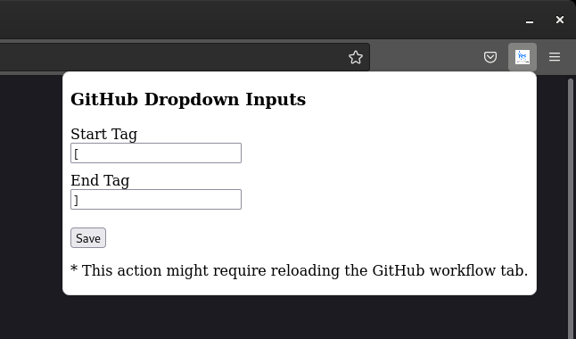

# gh-action-dropdown-list-input

Extends GitHub Action UI replacing plain text input fields to the dropdown.



## Install extension

- [Chrome](https://chrome.google.com/webstore/detail/github-action-dropdown-in/deogklnblohhopmnkllaeinijefddcnm)
> Firefox: is still in review process to be published.

#### Configuring tags

Go to the top right corner of the browser you are using and click on the extension logo. A screen will popup with tag options. Choose the right tags for you and save it.

> This action might require reloading the GitHub workflow tab.



## Usage

- Add inputs separated by `commas` and the default value by `tag` e.g. `brackets`.

[gh-action-dropdown-list-input.yml](https://github.com/arthurbdiniz/gh-action-dropdown-list-input/blob/main/.github/workflows/gh-action-dropdown-list-input.yml)
```yml
name: gh-action-dropdown-list-input

on:
  workflow_dispatch:
    inputs:
      environment:
        description: 'Environment'
        required: true
        default: 'dev,staging,[uat],prod'

jobs:
  build:
    runs-on: ubuntu-latest
    steps:
     - name: Print environment
        run: echo ${{ github.event.inputs.environment }}
```

## Development

- [Chrome](chrome/README.md)
- [Firefox](firefox/README.md)

## Package extension

```bash
# Chrome
make package-chrome

# Firefox
make package-firefox
```

## License

Apache 2 Licensed. See [LICENSE](https://github.com/arthurbdiniz/gh-action-dropdown-list-input/blob/master/LICENSE) for full details.